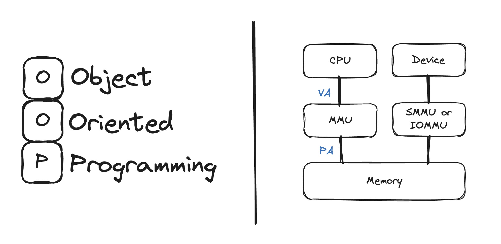

# 1.4 C++ 的起源

和 C 语言一样，C++ 也是在贝尔实验室诞生的，Bjamme Stroustrup 于 20 世纪 80 年代在这里开发出了这种语言。用他自己的话来说,“ C++ 主要是为了我的朋友和我不必再使用汇编语言、C 语言或其他现代高级语言来编程而设计的。它的主要功能是可以更方便地编写出好程序，让每个程序员更加快乐”。

 图 1-3-1 &nbsp; C++ 的二重性 

## 1.4.1 C++ 可移植性

假设你为运行着 Windows 10 操作系统的电脑编写了一个很好用的 C++ 程序，而管理人员决定使用其他操作系统如 MacOS 或 Linux 的计算机替换他，又比如这些替换的系统使用着如 ARM 架构的处理器，那么该程序是否可以在新的操作系统上运行呢？当然，在不改变代码的前提下，在新平台重新编译后即可良好运行，则该程序设计语言具有可移植性。

正是由于 C++ 具有良好的可移植性，使得它在程序员选择语言时备受青睐。

## 1.4.2 C++ 的重要地位

当今随着技术的不断演进，C++ 在国内外各大公司中占据着重要地位。无论是系统级编程、高性能计算还是大规模应用的开发，C++ 程序员都在这些领域发挥着关键作用。以下是解释为何大公司需要 C++ 程序员的几个重要原因。

**1. 系统级编程和嵌入式系统**

大公司通常涉及底层的系统级编程，例如操作系统、驱动程序或嵌入式系统的开发。在这些领域，C++ 提供了对硬件的低级别控制[^1]，使得程序员能够更加精确地管理内存和资源。其直接的内存访问和强大的指针操纵使得 C++ 成为理想的选择，确保程序的高效性和性能。

**2. 高性能计算和游戏开发**

在需要处理大规模数据集或进行高性能计算的场景中，C++ 凭借其高效的内存管理和丰富的标准模板库(STL)成为首选语言之一。游戏开发中也广泛使用 C++ ，因为它需要处理实时图形和复杂的物理引擎，要求高度优化的代码来确保用户顺畅的游戏体验。

**3. 系统软件和基础设施**

大公司通常拥有复杂的系统软件和基础设施，这些系统需要稳定、高效、可扩展的编程语言。C++ 的性能、可移植性和跨平台支持使得它成为开发操作系统、网络协议栈以及其他底层组件的理想选择。

**4. 图形界面和桌面应用程序**

C++ 在图形界面和桌面应用程序的开发中表现出色。大公司通常需要开发复杂的桌面工具、设计软件或其他图形界面应用。C++ 通过其图形库和框架，如 Qt[^2] ，使得开发人员能够创建功能强大、高度定制化的用户界面。

**5. 对性能和资源的高要求**

在大规模应用程序和服务中，对性能和资源的高要求是常态。C++ 以其近乎无损的性能和对硬件的直接控制，使得它成为构建高效、可伸缩和资源敏感型应用的首选语言。

## 1.4.3 C++ 标准

计算机语言也可能出现方言。Windows 10 C++的实现与 Red Hat Linux 或 MacOS 实现相同吗？虽然多数实现都希望其 C++ 版本与其他版本兼容但如果没有准确描述语言工作方式的公开标准，这将很难做到。因此，美国国家标准局(American NationalStandards Institute，ANSI)在 1990 年设立了一个委员会(ANSI X3J16)，专门负责制定 C++ 标准(ANSI制定了 C 语言标准)。国际标准化组织(ISO)很快通过自己的委员会(ISO-WG-21)加入了这个行列，创建了联合组织 ANSIISO ，致力于制定 C++ 标准。这些组织每年 3 次聚在一起,我们将它们统称为 ANSIISO 委员会。ANSIISO 决定制定一种标准，强调 C++ 是一种重要的、广泛应用的语言。它还表明 C++ 已经达到了一定程度的成熟，因为在语言高速发展时，它是不会引入标准的。无论如何，自从 ANSISO 委员会开始工作后，C++ 便发生了巨大的变化。

现在大多数编译器已对 C++11 提供了全面的完备的支持。本书的编写期间，有些编译器也已经做了支持 C++23 新特性的调整，随着新标准获批，对这些特性的支持会很快得到提升。这也是我使用电子版而不使用纸质版撰写本书的根本原因之一。他可以随着标准的调整提升，重新修订一些特性，从而让读者很快了解接受。

详细介绍 C++ 之前，先介绍一些有关程序创建的基本知识。

[^1]: C++ 提供了对计算机内存和硬件的底层控制能力，这使得开发者可以直接操作硬件资源，实现高效的系统级编程。
[^2]: Qt 是一个跨平台的 C++ 应用程序开发框架。广泛用于开发 GUI 程序，这种情况下又被称为部件工具箱。也可用于开发非 GUI 程序，例如控制台工具和服务器。Qt 被用于 OPIE、Skype、VLC media player、Adobe Photoshop Elements、VirtualBox 与 Mathematica 以及被 Autodesk 、欧洲空间局、梦工厂、 Google 、 HP 、 KDE 、卢卡斯影业、西门子公司、沃尔沃集团、华特迪士尼动画制作公司、三星集团、飞利浦、 Panasonic 所使用。——Wikipedia

