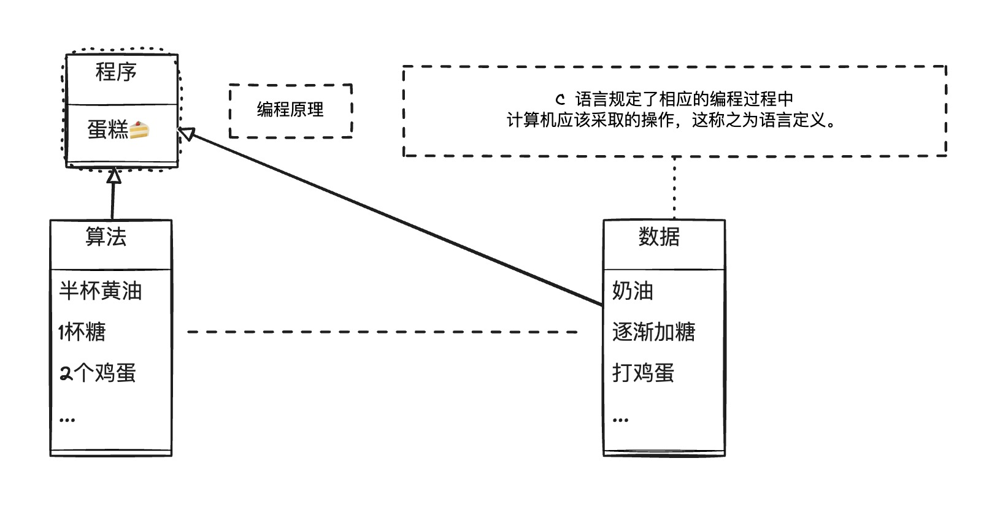

# 1.1 C++ 简介

在过去的几十年，计算机技术以令人惊讶的速度发展着，当今，笔记本电脑的计算速度和存储信息的能力都远远超过了上世纪 60 年代的超大型计算机。在 20 世纪 70 年代，C 和 Pascal 这样的语言引领人们进入了结构化编程时代，这种机制把秩序和规则带进了迫切需要这种性质的领域中。提供了除结构化编程工具外，C 还能生成简洁、快速运行的程序，并提供了处理硬件问题的能力，如管理通信端口和磁盘驱动器。这些因素使 C 语言成为 20 世纪 80 年代占统治地位的编程语言。同时，20 世纪 80 年代，人们也见证了一种新的编程模式，面向对象编程(OOP)的成长。SmallTalk 和 C++ 语言具备这种功能。下面将深入地介绍 C 和 OOP。

## 1.2.1 C 语言

20 世纪 70 年代早期，贝尔实验室的 Dennis Ritchie 致力于开发 UNIX 操作系统[^3]。为完成这项工作，Ritchie 需要一种语言，它必须简洁，能够生成简洁、快速的程序，并能有效地控制硬件。在当时传统上，程序员使用汇编语言来满足这些需求，汇编语言依赖于计算机的内部机器语言。不过，汇编语言是低级(low-level)语言，即直接操作硬件，如直接访问 CPU 寄存单元和内存单元。因此，要将汇编程序移植到另一种计算机上，必须使用不同的汇编语言重新编写程序。这有点像每次购买新车时，都发现设计人员改变了控制系统的位置和功能，客户不得不重新学习驾驶这辆新车。

不过，UNIX 是为在不同的计算机(或平台)上工作而设计的，这意味着它是一种高吸语言。高级(high-level)语言致力于解决问题，而不针对特定的硬件。一种被称为编译器的特殊程序将高级语言翻译成特定计算机的内部语言。这样，就可以通过对每个平台使用不同的编译器来在不同的平台上使用同一个高级语言程序了。Ritchie 希望有一种语言能将低级语言的效率、硬件访问能力和高级语言的通用性、可移植性融合在一起，于是他在旧语言的基础上开发了 C 语言。

## 1.2.2 C 语言编程原理

由于 C++ 在 C 语言的基础上移植了新的编程理念，因此我们首先来看一看 C 所遵循的旧的理念。一般来说，计算机语言要处理两个概念——数据和算法。数据是程序使用和处理的信息，而算法是程序使用的方法(参见图 1.1)。C 语言与当前最主流的语言一样，在最初面世时也是过程性(procedural)语言，这意味着它强调的是编程的算法方面。从概念上说，过程化编程首先要确定计算机应采取的操作，然后使用编程语言来实现这些操作。程序命令计算机按一系列流程生成特定的结果，就像菜谱指定了厨师做蛋糕时应遵循的一系列步骤一样。

 图 1-1-1 &nbsp; 数据 + 算法 = 程序 

随着程序规模的扩大，早期的程序语言(如FORTRAN 和 BASIC)都会遇到组织方面的问题。例如程序经常使用分支语句，根据某种测试的结果，执行一组或另一组指令。很多旧式程序的执行路径很混乱(被称为“意大利面条式编程”)，几乎不可能通过阅读程序来理解它，修改这种程序简直是一场灾难。为了解决这种问题，计算机科学家开发了一种更有序的编程方法--结构化编程(structured programming)。C 语言具有使用这种方法的特性。例如，结构化编程将分支(决定接下来应执行哪个指令)限制为一小组行为良好的结构。C 语言的词汇表中就包含了这些结构(for 循环、while 循环、do while 循环和 if-else 语句)。

另一个新原则是自上向下(top-down)的设计。在 C 语言中，其理念是将大型程序分解成小型、便于管理的任务。如果其中的一项任务仍然过大，则将它分解为更小的任务。这一过程将一直持续下去，直到将程序划分为小型的、易于编写的模块(整理一下书房。先整理桌子、桌面、档案柜，然后整理书架。好,先从桌子开始，然后整理每个抽屉，从中间的那个抽屉开始整理。也许我都可以管理这项任务)。C 语言的设计有助于使用这种方法，它鼓励程序员开发程序单元(称为函数)来表示各个任务模块。如上所述，结构化编程技术反映了过程性编程的思想，根据执行的操作来构思一个程序。

## 1.2.3 面向对象编程

虽然结构化编程的理念提高了程序的清晰度、可靠性，并使之便于维护，但它在编写大型程序时，仍面临着挑战。为应付这种挑战，OOP 提供了一种新方法。与强调算法的过程性编程不同的是，OOP 强调的是数据。OOP 不像过程性编程那样，试图使问题满足语言的过程性方法，而是试图让语言来满足问题的要求。其理念是设计与问题的本质特性相对应的数据格式。

在 C++ 中，类是一种规范，它描述了这种新型数据格式，对象是根据这种规范构造的特定数据结构。例如，类可以描述公司管理人员的基本特征(姓名、头衔、工资、特长等)，而对象则代表特定的管理人员(Guilford Sheepblat、副总裁、$925,000、知道如何恢复 Windows 注册表)。通常，类规定了可使用哪些数据来表示对象以及可以对这些数据执行哪些操作。例如，假设正在开发一个能够绘制矩形的计算机绘图程序，则可以定义一个描述矩形的类。定义的数据部分应包括顶点的位置、长和宽、4 条边的颜色和样式、矩形内部的填充颜色和图案等;定义的操作部分可以包括移动、改变大小、旋转、改变颜色和图案、将矩形复制到另一个位置上等操作。这样，当使用该程序来绘制矩形时，它将根据类定义创建一个对象。该对象保存了描述矩形的所有数据值，因此可以使用类方法来修改该矩形。如果绘制两个矩形，程序将创建两个对象，每个矩形对应一个。

OOP 程序设计方法首先设计类，它们准确地表示了程序要处理的东西。例如，绘图程序可能定义表示矩形、直线、圆、画刷以及画笔的类。类定义描述了对每个类可执行的操作，如移动圆或旋转直线。然后您便可以设计一个使用这些类的对象的程序。从低级组织(如类)到高级组织(如程序)的处理过程叫做自下向上(bottom-up)的编程。

OOP 编程并不仅仅是将数据和方法合并为类定义。例如，OOP 还有助于创建可重用的代码，这将减少大量的工作。信息隐藏可以保护数据，使其免遭不适当的访问。多态让您能够为操作符和函数创建多个定义，通过编程上下义来确定使用哪个定义。继承让您能够使用旧类派生出新类。正如接下来将看到的那样，OOP 引入了很多新的理念，使用的编程方法不同于过程性编程。它不是将重点放在任务上，而是放在表示概念上。有时不定使用自顶向下的编程方法，而是使用自下向上的编程方法。本书将通过大量易于掌握的范例帮助读者理解这些要点。

设计有用、可靠的类是一项艰巨的任务，幸运的是，OOP 语言使程序员在编程中能够轻松地使用已有的类。广商提供了大量有用的类库，包括设计用于简化 Windows 或 Mac 环境下编程的类库。C++真正的优点之一是:可以方便地重用和修改现有的、经过仔细测试的代码。

## 1.2.4 C++ 和泛型编程

## 1.2.4 C++ 的起源

## 1.2.4 C++ 的重要地位

当今随着技术的不断演进，C++ 在国内外各大公司中占据着重要地位。无论是系统级编程、高性能计算还是大规模应用的开发，C++ 程序员都在这些领域发挥着关键作用。以下是解释为何大公司需要 C++ 程序员的几个重要原因。

**1. 系统级编程和嵌入式系统**

大公司通常涉及底层的系统级编程，例如操作系统、驱动程序或嵌入式系统的开发。在这些领域，C++ 提供了对硬件的低级别控制[^1]，使得程序员能够更加精确地管理内存和资源。其直接的内存访问和强大的指针操纵使得 C++ 成为理想的选择，确保程序的高效性和性能。

**2. 高性能计算和游戏开发**

在需要处理大规模数据集或进行高性能计算的场景中，C++ 凭借其高效的内存管理和丰富的标准模板库(STL)成为首选语言之一。游戏开发中也广泛使用 C++ ，因为它需要处理实时图形和复杂的物理引擎，要求高度优化的代码来确保用户顺畅的游戏体验。

**3. 系统软件和基础设施**

大公司通常拥有复杂的系统软件和基础设施，这些系统需要稳定、高效、可扩展的编程语言。C++ 的性能、可移植性和跨平台支持使得它成为开发操作系统、网络协议栈以及其他底层组件的理想选择。

**4. 图形界面和桌面应用程序**

C++ 在图形界面和桌面应用程序的开发中表现出色。大公司通常需要开发复杂的桌面工具、设计软件或其他图形界面应用。C++ 通过其图形库和框架，如 Qt[^2] ，使得开发人员能够创建功能强大、高度定制化的用户界面。

**5. 对性能和资源的高要求**

在大规模应用程序和服务中，对性能和资源的高要求是常态。C++ 以其近乎无损的性能和对硬件的直接控制，使得它成为构建高效、可伸缩和资源敏感型应用的首选语言。

[^1]: C++ 提供了对计算机内存和硬件的底层控制能力，这使得开发者可以直接操作硬件资源，实现高效的系统级编程。
[^2]: Qt 是一个跨平台的 C++ 应用程序开发框架。广泛用于开发 GUI 程序，这种情况下又被称为部件工具箱。也可用于开发非 GUI 程序，例如控制台工具和服务器。Qt 被用于 OPIE、Skype、VLC media player、Adobe Photoshop Elements、VirtualBox 与 Mathematica 以及被 Autodesk 、欧洲空间局、梦工厂、 Google 、 HP 、 KDE 、卢卡斯影业、西门子公司、沃尔沃集团、华特迪士尼动画制作公司、三星集团、飞利浦、 Panasonic 所使用。——Wikipedia
[^3]: UNIX 系统是一个分时系统。最早的 UNIX 系统于 1970 年问世。此前，只有面向批处理作业的操作系统，这样的系统对于需要立即得到响应的用户来说是太慢了。在 60 年代末，Kenneth Thompson 和 Dennis Ritchie 都曾参加过交互方式分时系统 Multics 的设计，而开发该系统所使用的工具是 CTSS 。这两个系统在操作系统的发展过程中都产生过重大影响。在此基础上，在对当时现有的技术进行精选提炼和发展的过程中，K.Thompson 于 1969 年在小型计算机上开发 UNIX 系统，后于 1970 年投入运行。——百度百科
