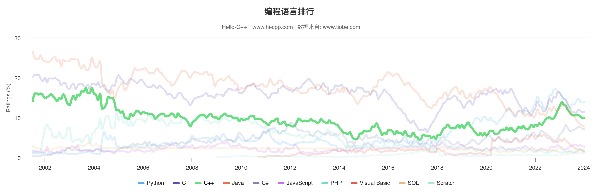

# 第 1 章 基础知识

!!! abstract "本章内容概述"

    - C/C++ 语言的发展历史及其基本原理；
    - 面向过程编程和面向对象编程；
    - C++ 是如何在 C 语言的基础上添加面向对象概念的；
    - C++ 是如何在 C 语言的基础上添加泛型编程概念的；
    - 编程语言标准。

很高兴你能了解并愿意学习 C++ 这门编程语言。

这是一个优秀的、神奇的、令人兴奋的语言，它在面向过程编程[^1]的 C 语言的基础上添加了面向对象编程[^2]和泛型编程[^3]的支持，早在20世纪90年代便是最重要的编程语言之一，并在21世纪的今天仍然保持强劲的势头。C++ 继承了 C 语言的高效性、简洁性、快速性和可移植性，与 C 语言一样，提供了对计算机内存和硬件的底层控制能力，这使得开发者可以直接操作硬件资源，实现高效的系统级编程。C++ 在 C 语言的基础上新增了面向对象特性，该特性的加入为 C++ 带来的全新的编程方法和体验。面向对象是为了应对现代复杂程度不断提高的编程任务而设计的。C++ 还有一个杀手锏，这便是“模板”，模板也为 C++ 提供了一种全新的编程方法——泛型。

这些功能使 C++ 成为一把锋利的的双刃宝剑，一方面使 C++ 不同于其他语言无比强大，另一方面则意味着有更多的东西需要学习。但 C++ 有着丰富的生态系统，包括大量的开源库和框架，使得开发者能够更加高效地完成各种任务。

 图 1-0-1 &nbsp; 编程语言排行 

!!! success "保持历史正确的说明"

    本章节因涉及诸多历史发展考证，由于我个人因素为了保证其相关发展史的正确性，我可能会引用 C++ Primer Plus (第六版)中的内容，并就其新手难以理解的词条、语意、知识和插图进行编辑、修改和添加注释。

[^1]: 面向过程编程(Procedure Oriented Programming，简称POP)。
[^2]: 面向对象编程(Object-Oriented Programming，简称OOP)。
[^3]: 泛型编程(Generic Programming)。