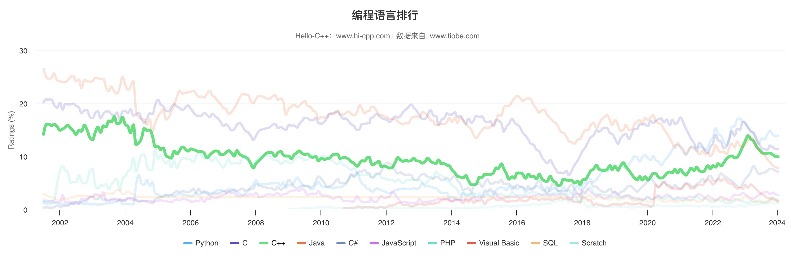

# 第 1 章 基础知识

!!! abstract "本章内容概述"

    - C/C++ 语言的发展历史及其基本原理；
    - 面向过程编程和面向对象编程；
    - C++ 是如何在 C 语言的基础上添加面向对象概念的；
    - C++ 是如何在 C 语言的基础上添加泛型编程概念的；
    - 编程语言标准；
    - 创建程序/项目的技巧。

很高兴你能了解并愿意学习 C++ 这门编程语言。

这是一个优秀的、神奇的、令人兴奋的语言，它在面向过程编程[^1]的 C 语言的基础上添加了面向对象编程[^2]和泛型编程[^3]的支持，早在20世纪90年代便是最重要的编程语言之一，并在21世纪的今天仍然保持强劲的势头。

 图 1-1-1 &nbsp; 编程语言排行 

[^1]: 面向过程编程(Procedure Oriented Programming，简称POP)。
[^2]: 面向对象编程(Object-Oriented Programming，简称OOP)。
[^3]: 泛型编程(Generic Programming)。