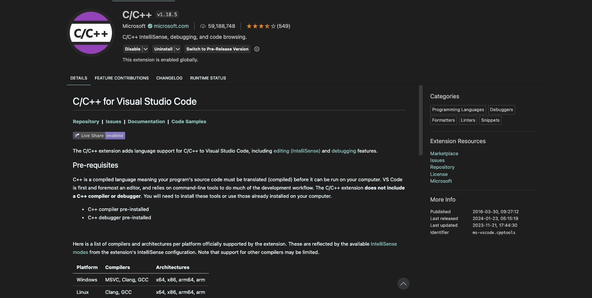

# 1.4 安装 IDE

## 1.4.1 何为 IDE

IDE(Integrated Development Environment，即集成开发环境)。是一种软件应用程序，提供了一套集成的工具和功能，用于支持软件开发。IDE旨在简化和加速开发过程，通常包括代码编辑器、调试器、编译器、构建工具、版本控制系统等功能。

## 1.4.2 IDE 功能比对

| IDE                   | 适用平台 | 是否免费 | 安装难度 | 描述                                                   |
| --------------------- | ------- | ------ | :---: |------------------------------------ |
| Visual Studio         | Windows | 社区免费    | `简单` |号称宇宙第一 IDE，是流行的集成开发环境，支持C++开发。           |
| Eclipse               | Linux   | 社区免费    | `简单` |流行的跨平台开发环境，可在Linux上进行C++开发。            |
| Code::Blocks          | Linux   | 免费        | `简单` |流行的跨平台开发环境，可在Linux上进行C++开发。            |
| Xcode                 | MacOS   | Apple免费   | `简单` |Apple提供的IDE，适用于macOS和iOS开发，支持C++。            |
| Visual Studio Code    | ALL     | 免费        | `简单` |轻量级、开源的代码编辑器，支持多种编程语言，使用 VSCode 进行 C++ 开发通常需要配置适当的插件和工具链。    |
| CLion                 | ALL     | 付费        | `简单` |CLion 是一个专注于 C 和 C++ 开发的强大 IDE，提供了丰富的功能和工具，适用于各种 C/C++ 项目。    |

 表 1-4-1 &nbsp; IDE 功能比对 

## 1.4.3 IDE 下载地址

| IDE                   | 适用平台 | 是否免费 | 下载地址                                                  |
| --------------------- | ------- | ------ | ----------------- |
| Visual Studio         | Windows | 社区免费    | [https://visualstudio.microsoft.com/zh-hans/downloads/](https://visualstudio.microsoft.com/zh-hans/downloads/) |
| Eclipse               | Linux   | 社区免费    | [https://www.eclipse.org/downloads/](https://www.eclipse.org/downloads/) |
| Code::Blocks          | Linux   | 免费        | [https://www.codeblocks.org/downloads/](https://www.codeblocks.org/downloads/) |
| Xcode                 | MacOS   | Apple免费   | [https://developer.apple.com/cn/xcode/resources/](https://developer.apple.com/cn/xcode/resources/) |
| Visual Studio Code    | ALL     | 免费        | [https://code.visualstudio.com/Download](https://code.visualstudio.com/Download) |
| CLion                 | ALL     | 付费        | [https://www.jetbrains.com/clion/](https://www.jetbrains.com/clion/) |

 表 1-4-2 &nbsp; IDE 下载地址 

## 1.4.4 说明

本书中相关代码在 VSCode 中编写，你可在 Github 中下载，下载后可在上述主流 IDE 中运行。不必纠结该使用哪个，初学者建议在 Windows 平台中使用 Visual Studio 社区版，其免费强大的功能可能会令你在学习过程中事半功倍。在 MacOS 平台中建议使用 Visual Studio Code(免费) 或 CLion(付费)，Visual Studio Code 其强大开源可能在你学习编程的路途中让你游刃有余，而 CLion 更类似于 Visual Studio。

使用 Visual Studio Code 进行 C++ 开发通常需要配置适当的插件和工具链。插件是由 Microsoft 提供的官方插件，用于提供 C++ 开发支持。

 图 1-4-1 &nbsp; VSCode C/C++ 插件 

有了工具，学习起 C++ 对我们来说不再棘手，下面我们将正式踏上 C++ 的打怪之路。另外，对于初学者，可能环境的正确配置很难，如果你遇到问题，可以在下方评论区留言，我会一一解答。